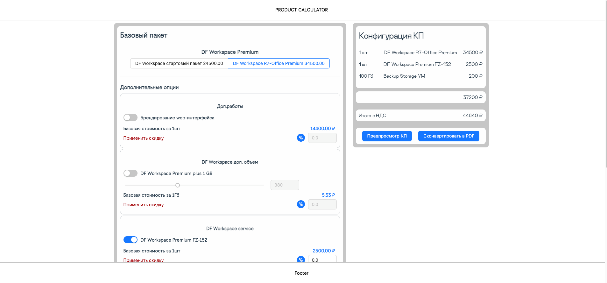

<h1 style="text-align: center;">Product Calculator</h1>

Продуктовый калькулятор, для подсчета итоговой стоимости комерческого предложения.

___

<h3>Технологии:</h3>

- HTML, CSS, 

- UI-librery - Ant-Design

- Vite, React, Redux-Toolkit

___

<h3>Описание:</h3>

Приложение отображает продукт компании с линейкой опций для формирования коммерчиского предложения.

Предлагается выбрать одну из основных (базовых) опций, которая открывает возможность добавлять в комерческое предложение дополнительные доступные  для основной опции.

При добавлении опции с помощью радио-кнопки, в калькулятор добавляеться заголовок, количество и стоимость. К опциям есть возможность применить скидку, но не более чем максимально установленная. Все добавленные опции суммируються по стоимости и отображают общую стоимость и стоимость с учетом НДС. Калькулятор реагирует реактивно и всегда отображает актуальные значения КП выбранные оператором.

___

<h3>Внешний вид:</h3>



___

<h3>Деплой:</h3>
Деплой приложения осуществлен через gh-page по ссылке

https://alexwebart.github.io/productCalculator
___

<h3>Локальная установка:</h3>

Для локального запуска приложения требуется предустановленный ``Node.js``:
1. Склонируйте репозиторий
```
git clone https://github.com/AlexWEBArt/productCalculator.git
```
2. Установите зависимости в папку с приложением через терминал
```
npm install
```
3. Запустите локальный сервер
```
npm run dev
```
4. Приложение запуститья по адресу
```
http://localhost:5173
```
___
